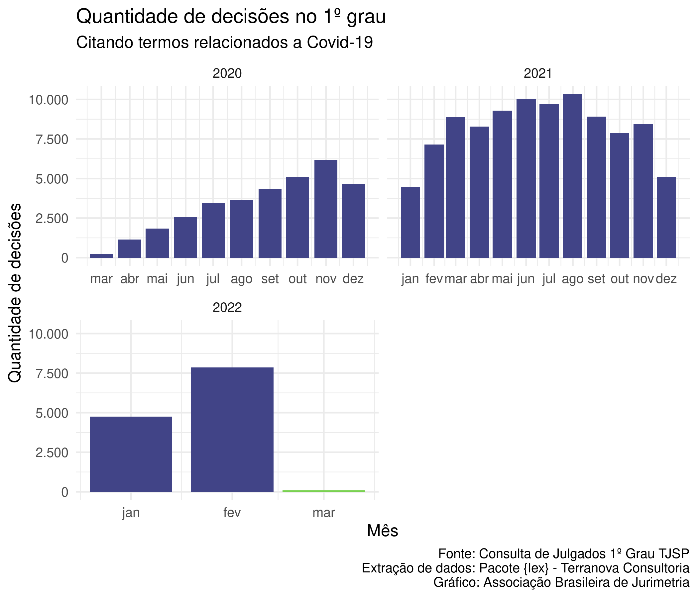

<!-- README.md is generated from README.Rmd. Please edit that file -->

# covidTJSP 

<!-- badges: start -->

[](https://github.com/abjur/covidTJSP/actions)
<!-- badges: end -->

Baixa e estrutura dados de covid do TJSP.

``` r
library(covidTJSP)
#> 
#> Attaching package: 'covidTJSP'
#> The following objects are masked _by_ '.GlobalEnv':
#> 
#>     da_cjpg_covid, da_cpopg_covid
```

**Última atualização:** 30/10/2021.

Os dados podem ser baixados nos links abaixo.

  - [Consulta de Julgados do Primeiro
    Grau](https://github.com/abjur/covidTJSP/blob/master/inst/extdata/da_cjpg_covid.xlsx?raw=true)
  - [Consulta de Processos do Primeiro
    Grau](https://github.com/abjur/covidTJSP/blob/master/inst/extdata/da_cpopg_covid.xlsx?raw=true)

## Exemplo de aplicação

``` r
covidTJSP::da_cjpg_covid %>% 
  dplyr::arrange(dplyr::desc(date)) %>% 
  dplyr::distinct(n_processo, .keep_all = TRUE) %>% 
  dplyr::mutate(mes = lubridate::floor_date(date, "month")) %>% 
  dplyr::count(mes) %>% 
  dplyr::arrange(mes) %>% 
  dplyr::mutate(acu = cumsum(n)) %>% 
  dplyr::mutate(tipo = dplyr::case_when(
    mes == lubridate::floor_date(Sys.Date(), "month") ~ "incompleto",
    TRUE ~ "completo"
  )) %>% 
  ggplot2::ggplot(ggplot2::aes(mes, n, fill = tipo)) +
  ggplot2::geom_col() +
  ggplot2::scale_x_date(
    date_breaks = "1 month",
    date_labels = "%b"
  ) +
  ggplot2::scale_y_continuous(labels = scales::number_format(
    big.mark = ".", decimal.mark = ","
  )) +
  ggplot2::scale_fill_viridis_d(begin = .2, end = .8) +
  ggplot2::guides(fill = FALSE) +
  ggplot2::theme_minimal(12) +
  ggplot2::labs(
    title = "Quantidade de decisões no 1º grau",
    subtitle = "Citando termos relacionados a Covid-19",
    x = "Mês",
    y = "Quantidade de decisões",
    caption = paste(
      "Fonte: Consulta de Julgados 1º Grau TJSP",
      "Extração de dados: Pacote {lex} - Terranova Consultoria",
      "Gráfico: Associação Brasileira de Jurimetria",
      sep = "\n"
    )
  )
```



# Licença

MIT
